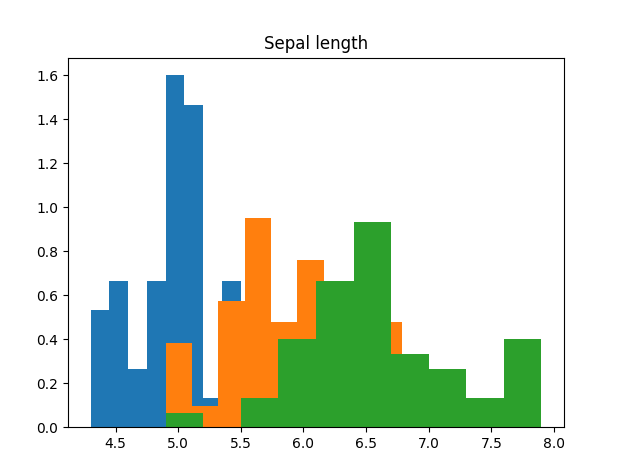
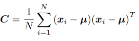
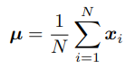

# MachineLearning
Repository including all my Machine Learning codes developed through the Machine Learning course at Politecnico di Torino

# loadingIRISDataset code
This code is simple and the only purpose of it was to study how to load a CSV dataset (included also here in the repo).

It takes one argument that is the name of the CSV file to read and organize it in a 4x150 dim array, each row corresponding to a different attribute: sepal length, sepal width, petal length and petal width. It is based on the famous IRIS dataset.

Also, it creates a 1x150 dim array containing all the class labels: iris setosa = 0, iris versicolor = 1, iris virginica = 2.

At the end, it will create a bar view of the values of the Sepal Length for the different classes and its values just to visualize it:

# PCA code
The code implements Principal Component Analysis, which allows reducing the dimensionality of a dataset by projecting
the data over the principal components.

PCA function receives D (data matrix where columns are the different samples and lines are the attributes of each sample) and "m" which is the number of dimensions to be considered.

## Computation of the data covariance matrix
The first step is to compute the data covariance matrix, since it will be needed further on to retrieve the largest eigenvalues.
The expression is as follows:

where $\mu$ is the Dataset mean, calculated as follows:

## Retrieving eigenvectors and eigenvalues
Using numpy.linalg.eigh it is possible to retrieve the eigenvalues, sorted from smallest to largest, and the corresponding eigenvectors of it.

## Projection 
Finally, it is possible to apply the projection to a single point x or to a matrix of samples D using the retrieved eigenvectors.
